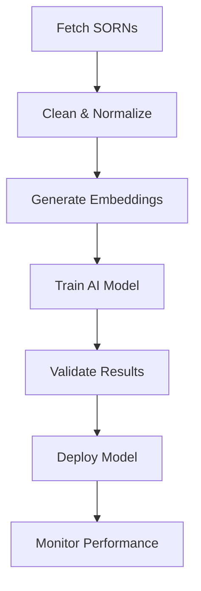

# PiperPrivacySorn - Technical Architecture

## Overview

PiperPrivacySorn is a comprehensive WordPress plugin designed to manage privacy System or Record Notices (SORN). SORN requiremnts coem from The Privacy Act of 1974, as amended, (“Privacy Act” or “the Act”) (5 U.S.C. 552a), Public Law 93-579. Built on modern WordPress architecture, it follows SOLID principles and WordPress development best practices.

## Technology Stack

### Core Requirements
- WordPress 6.0+
- PHP 8.0+
- MySQL 5.7+ / MariaDB 10.3+

### Key Dependencies
1. **Data Management**
   - MetaBox Pro (Custom fields framework)
   - Advanced Custom Fields PRO (Additional field types)
   - MetaBox AIO (All-in-one extension pack)
   - MetaBox - FrontEnd Submission

2. **Form Management**
   - Fluent Forms Pro
   - Fluent Forms PDF
   - Fluent Forms API Integrations

3. **UI/UX Framework**
   - Bricks Builder (Visual Website Builder)
   - Automatic CSS (ACSS) for dynamic styling
   - CSS Custom Properties for theming
   - BEM CSS naming

4. **Workflow Management**
   - FluentBoards
   - FluentCRM (For notifications)
   - WP Cron Manager (For scheduled tasks)

## Architecture

### 1. Core Structure
```php
piper-privacy/
├── admin/                     # Admin-specific functionality
│   ├── css/                  # Admin styles
│   ├── js/                   # Admin scripts
│   └── partials/             # Admin templates
├── includes/                 # Core plugin files
│   ├── core/                # Core functionality
│   │   ├── class-plugin.php      # Main plugin initialization
│   │   ├── class-loader.php      # WordPress hooks/filters manager
│   │   └── class-i18n.php        # Internationalization
│   ├── modules/             # Feature modules
│   │   ├── collection-manager/    # Privacy collection management
│   │   ├── threshold-manager/     # Privacy threshold assessment
│   │   └── impact-manager/        # Privacy impact assessment
│   ├── interfaces/          # Core interfaces
│   └── traits/              # Shared traits
├── languages/               # Internationalization
├── public/                  # Public-facing assets
│   ├── css/
│   ├── js/
│   └── partials/
└── assets/                   # Static resources
```

### 2. Key Components

#### Collection Manager
- Manages privacy collection records
- Handles data minimization
- Implements retention policies
- Workflow management

#### Threshold Manager
- Privacy threshold assessments
- Risk evaluation
- Automated decision support
- Threshold criteria management

#### Impact Manager
- Privacy impact assessments
- Detailed risk analysis
- Mitigation strategies
- Compliance documentation

### 3. Security Model

#### User Roles and Capabilities
```
- Administrator
  └── All capabilities

- Privacy Officer
  ├── read_privacy_collection
  ├── edit_privacy_collections
  ├── publish_privacy_collections
  ├── delete_privacy_collections
  └── ...

- System Owner
  ├── read_privacy_collection
  ├── edit_privacy_collection
  └── edit_privacy_collections
```

## Data Flow

1. **Collection Creation**
   - Department initiates privacy collection
   - Automated threshold assessment
   - Workflow triggers based on risk level

2. **Assessment Process**
   - Threshold evaluation
   - Impact assessment (if required)
   - Stakeholder reviews
   - Final approval/rejection

3. **Ongoing Management**
   - Regular reviews
   - Retention management
   - Compliance monitoring
   - Audit logging

## Integration Points

1. **WordPress Core**
   - Custom post types
   - REST API endpoints
   - Admin interfaces
   - Capabilities system

2. **External Systems**
   - Email notifications
   - API integrations
   - Export capabilities
   - Reporting systems

## Performance Considerations

1. **Optimization**
   - Database query optimization
   - Cache implementation
   - Asset minification
   - Lazy loading

2. **Scalability**
   - Modular architecture
   - Efficient data structures
   - Background processing
   - Resource management

## Security Measures

1. **Data Protection**
   - Input sanitization
   - Output escaping
   - Nonce verification
   - Capability checks

2. **Privacy**
   - Data encryption
   - Access controls
   - Audit logging
   - Data minimization

## Future Considerations

1. **Planned Enhancements**
   - AI-powered risk assessment
   - Advanced reporting
   - Integration templates
   - Workflow automation

2. **Extensibility**
   - Plugin hooks
   - Filter system
   - Custom endpoints
   - Integration APIs

## Plugin Architecture

### 1. Core Structure
```php
piper-privacy/
├── includes/
│   ├── Core/                     # Core WordPress plugin infrastructure
│   │   ├── class-plugin.php      # Main plugin initialization
│   │   ├── class-loader.php      # WordPress hooks/filters manager
│   │   └── class-i18n.php        # Internationalization
│   ├── post-types/              # Custom post type definitions
│   │   ├── class-privacy-collection.php
│   │   ├── class-privacy-threshold.php
│   │   └── class-privacy-impact.php
│   ├── integrations/           # Third-party integrations
│   │   ├── class-acf-integration.php
│   │   ├── class-metabox-integration.php
│   │   ├── class-fluentforms-integration.php
│   │   └── class-fluentboards-integration.php
│   ├── workflow/               # Workflow management
│   │   ├── class-workflow-manager.php
│   │   ├── class-workflow-installer.php
│   │   ├── class-workflow-config.php
│   │   └── class-workflow-sla.php
│   ├── UI/                    # UI components
│   ├── accessibility/         # Accessibility features
│   ├── ai/                    # AI integrations
│   ├── analytics/            # Analytics tracking
│   ├── audit/                # Audit logging
│   ├── config/               # Configuration management
│   ├── documents/            # Document generation
│   ├── helpers/              # Utility functions
│   ├── modules/              # Feature modules
│   └── stakeholders/         # Stakeholder management
├── admin/                    # Admin interface
│   ├── css/
│   ├── js/
│   ├── partials/
│   └── templates/
├── public/                   # Public-facing features
│   ├── css/
│   ├── js/
│   └── partials/
└── assets/                   # Static resources
```

### 2. Autoloader Implementation
```php
// Project-specific namespace prefix
$prefix = 'PiperPrivacy\\';

// Autoloader logic
spl_autoload_register(function ($class) {
    // Convert namespace to file path
    $file = PIPER_PRIVACY_DIR . 'includes/' . str_replace('\\', '/', $relative_class);
    
    // Try with class- prefix
    $file = $dir_path . '/class-' . strtolower($class_name) . '.php';
    if (file_exists($file)) {
        require $file;
        return;
    }

    // Fallback without prefix
    $file = $dir_path . '/' . strtolower($class_name) . '.php';
    if (file_exists($file)) {
        require $file;
    }
});
```

### 3. Error Handling & Logging
```php
// Custom error handler
set_error_handler('piper_privacy_error_handler', E_ALL);
set_exception_handler('piper_privacy_exception_handler');

// Debug logging
if (PIPER_PRIVACY_DEBUG) {
    error_log($message, 3, PIPER_PRIVACY_DIR . 'debug.log');
}

// Database logging
$wpdb->prefix . 'piper_privacy_audit_log'
$wpdb->prefix . 'piper_privacy_workflow_history'
```

### 4. Custom Post Types & Taxonomies
```php
- privacy_collection
  ├── Taxonomies
  │   ├── privacy_collection_status
  │   └── privacy_collection_system
  └── Capabilities
      ├── edit_privacy_collection
      ├── edit_privacy_collections
      ├── edit_others_privacy_collections
      └── ...

- privacy_threshold
  ├── Taxonomies
  │   └── privacy_threshold_status
  └── Capabilities
      ├── edit_privacy_threshold
      ├── edit_privacy_thresholds
      └── ...

- privacy_impact
  ├── Taxonomies
  │   └── privacy_impact_risk
  └── Capabilities
      ├── edit_privacy_impact
      ├── edit_privacy_impacts
      └── ...
```

### 5. Role-Based Access Control
```
- Administrator
  └── All capabilities

- Privacy Officer
  ├── read_privacy_collection
  ├── edit_privacy_collections
  ├── publish_privacy_collections
  ├── delete_privacy_collections
  └── ...

- System Owner
  ├── read_privacy_collection
  ├── edit_privacy_collection
  └── edit_privacy_collections
```

### 6. Workflow Stages
```php
Collection Workflow:
1. Draft
   └── Initial data entry
2. PTA Required
   └── Threshold assessment needed
3. PTA In Progress
   └── Assessment being completed
4. PTA Review
   └── Assessment under review
5. PIA Required
   └── Impact assessment needed
6. PIA In Progress
   └── Impact assessment being completed
7. PIA Review
   └── Impact assessment under review
8. Implementation
   └── Controls being implemented
9. Active
   └── Collection in production
10. Under Review
    └── Periodic review
11. Retirement
    └── End-of-life planning
12. Archived
    └── Historical record
```

### 7. Database Schema
```sql
-- Audit Log
CREATE TABLE {$prefix}piper_privacy_audit_log (
    id bigint(20) NOT NULL AUTO_INCREMENT,
    user_id bigint(20) NOT NULL,
    action varchar(50) NOT NULL,
    object_type varchar(50) NOT NULL,
    object_id bigint(20) NOT NULL,
    details longtext NOT NULL,
    created_at datetime NOT NULL,
    PRIMARY KEY (id)
);

-- Workflow History
CREATE TABLE {$prefix}piper_privacy_workflow_history (
    id bigint(20) NOT NULL AUTO_INCREMENT,
    workflow_id bigint(20) NOT NULL,
    object_id bigint(20) NOT NULL,
    from_stage varchar(50) NOT NULL,
    to_stage varchar(50) NOT NULL,
    user_id bigint(20) NOT NULL,
    comments text,
    created_at datetime NOT NULL,
    PRIMARY KEY (id)
);
```

## Development Guidelines

### 1. Coding Standards
- WordPress Coding Standards
- PHP PSR-12
- JavaScript Standard Style
- CSS/SCSS Guidelines

### 2. Documentation
- PHPDoc blocks
- Inline comments
- README files
- API documentation
- User documentation

### 3. Testing
- Unit testing (PHPUnit)
- Integration testing
- Accessibility testing
- Performance testing
- Security testing

### 4. Version Control
- Feature branches
- Semantic versioning
- Descriptive commit messages
- Code review process
- Release management

# PiperPrivacy SORN Management Technical Architecture

## Overview

This document outlines the technical architecture and implementation details for managing System of Records Notices (SORNs) within the PiperPrivacy WordPress plugin.

## Core Components

### 1. SORN Collection Management

#### Data Structure
- Custom Post Type: `privacy_sorn`
- Custom Taxonomies:
  - `sorn_status`: Tracks SORN lifecycle states
  - `sorn_category`: Categorizes SORNs by type/purpose
  - `sorn_agency`: Associates SORNs with specific agencies
  - `sorn_publication`: Tracks publication status

#### Key Classes
- `PrivacySorn_Collection`: Manages SORN collections and relationships
- `PrivacySorn_Form`: Handles SORN form submission and validation
- `PrivacySorn_Publisher`: Manages publication workflows
- `PrivacySorn_FederalRegister`: Handles Federal Register integration

### 2. SORN Lifecycle States and Requirements

#### Complete Lifecycle Flow
```
[Initial Draft] -> [SME Review] -> [Privacy Office Review] -> [Legal Review] -> [Agency Head Review]
       ↑              ↑                    ↑                       ↑                    |
       |              |                    |                       |                    v
       |              |                    |                       |             [Agency Approval]
       |              |                    |                       |                    |
       |              |                    |                       |                    v
       |              |                    |                       |         [Federal Register Submission]
       |              |                    |                       |                    |
       +              |                    |                       |                    v
[Revision Needed] ----+--------------------+-----------------------+         [Public Comment Period]
                                                                                      |
                                                                                      v
[Archive] <- [Sunset Review] <- [Active Monitoring] <- [Agency Website] <- [Final Publication]
    ↑                                      |                                          ↑
    +--------------------------------------+                                          |
                                                                                     |
                            [Emergency Update]---------------------------------->-----+
```

#### State-Specific Requirements

##### Initial Draft
- Required Fields:
  - System name and number
  - Categories of individuals
  - Categories of records
  - Routine uses
  - Storage practices
  - Retention policies
  - Access controls
- Validation rules for completeness
- Supporting documentation requirements

##### SME Review
- Technical accuracy verification
- System architecture review
- Data flow validation
- Security control assessment
- Records management compliance

##### Privacy Office Review
- Privacy threshold analysis
- Privacy impact assessment
- Fair information practice principles
- Privacy risk assessment
- Mitigation strategy review

##### Legal Review
- Legal authority verification
- Routine use justification
- Records retention compliance
- Administrative Procedure Act requirements
- Privacy Act compliance assessment

##### Agency Head Review
- Policy alignment verification
- Resource allocation assessment
- Impact analysis review
- Strategic alignment check
- Final authority approval

##### Agency Approval
- Official signoff workflow
- Documentation package preparation
- Internal tracking number assignment
- Publication package preparation
- Stakeholder notification

##### Federal Register Submission
- XML format preparation
- Required metadata inclusion
- Submission tracking
- Payment processing
- Proof review process

##### Public Comment Period
- Comment collection system
- Response tracking
- Analysis framework
- Response preparation
- Update determination

##### Final Publication
- Federal Register publication
- Agency website updates
- System implementation verification
- Stakeholder notification
- Public announcement

##### Agency Website Publication
- Content formatting for web
- 508 compliance verification
- Metadata optimization
- Search indexing
- Archive preparation

##### Active Monitoring
- Periodic review scheduling
- Change impact assessment
- Compliance monitoring
- Incident response procedure
- Update trigger identification

##### Sunset Review
- Continued necessity assessment
- System status verification
- Usage statistics analysis
- Cost-benefit review
- Retirement consideration

##### Archive
- Historical record preservation
- Access maintenance
- Reference capability
- Restoration procedure
- Deletion schedule

#### Automated Workflows

##### State Transitions
```php
[
    'triggers' => [
        'draft_complete' => [
            'validation' => 'validateDraftRequirements',
            'notification' => ['sme_team', 'privacy_office'],
            'actions' => ['createReviewTask', 'updateStatus']
        ],
        'sme_approved' => [
            'validation' => 'validateSMEApproval',
            'notification' => ['privacy_office'],
            'actions' => ['createPrivacyReviewTask', 'updateStatus']
        ],
        // Additional triggers for each state transition
    ]
]
```

##### Publication Requirements
```php
[
    'federal_register' => [
        'required_formats' => ['XML', 'PDF'],
        'metadata' => [
            'agency_code',
            'document_type',
            'filing_type',
            'publication_date'
        ],
        'validation_rules' => [
            'xml_schema' => 'FR-SORN-2024.xsd',
            'content_rules' => 'validateFRContent'
        ]
    ],
    'agency_website' => [
        'required_formats' => ['HTML', 'PDF', 'XML'],
        'accessibility' => [
            'section_508',
            'wcag_2_1'
        ],
        'metadata' => [
            'schema_org',
            'dublin_core'
        ]
    ]
]
```

### 3. Data Model

#### SORN Core Fields
```php
[
    'sorn_number'           => string,  // Unique identifier
    'system_name'           => string,  // Name of the system of records
    'agency_division'       => string,  // Responsible agency/division
    'effective_date'        => date,    // When SORN becomes effective
    'categories_records'    => array,   // Categories of records
    'authority'            => string,  // Legal authority
    'purpose'              => string,  // Purpose of the system
    'routine_uses'         => array,   // Routine uses of records
    'retention_policy'     => string,  // Records retention policy
    'safeguards'          => string,  // Security measures
]
```

### 4. Technical Implementation

#### Database Schema
- Utilizes WordPress custom tables for SORN-specific data
- Leverages `$wpdb` for optimized queries
- Implements proper indexing for performance

#### API Endpoints
```php
// REST API Routes
'piper-privacy/v1' => [
    '/sorns'                    => ['GET', 'POST'],
    '/sorns/(?P<id>[\d]+)'     => ['GET', 'PUT', 'DELETE'],
    '/sorns/(?P<id>[\d]+)/history' => ['GET'],
    '/sorns/categories'         => ['GET'],
    '/sorns/agencies'          => ['GET'],
]
```

### 5. Security Implementation

#### Access Control
- Role-based permissions using WordPress capabilities
- Custom capabilities for SORN management:
  - `manage_sorns`
  - `publish_sorns`
  - `edit_sorns`
  - `delete_sorns`

#### Data Validation
- Input sanitization using WordPress functions
- Custom validation rules for SORN fields
- NONCE verification for form submissions

### 6. Workflow Automation

#### Notifications
- Email notifications for state transitions
- Integration with WordPress cron for scheduled tasks
- Configurable notification templates

#### Review Process
- Multi-step review workflow
- Comment/feedback system
- Version control for SORN revisions

### 7. Search and Discovery

#### Search Implementation
- Custom search indexing for SORN content
- Advanced filtering capabilities
- Full-text search support

#### Export Capabilities
- PDF generation for official documentation
- CSV export for data analysis
- XML export for system integration

## Development Guidelines

### Coding Standards
- Follow WordPress PHP Coding Standards
- Use proper namespacing: `PiperPrivacySorn\*`
- Implement PHPDoc documentation

### Testing Strategy
- Unit tests for core functionality
- Integration tests for workflows
- End-to-end testing for critical paths

### Performance Considerations
- Implement caching for frequently accessed data
- Optimize database queries
- Use transients for temporary data storage

## Integration Points

### External Systems
- Federal Register API integration
- Agency compliance systems
- Document management systems

### WordPress Core
- Custom post type registration
- Taxonomy integration
- Capability management
- REST API extensions

## Deployment and Maintenance

### Version Control
- Git-based workflow
- Semantic versioning
- Change documentation

### Database Updates
- Version-controlled schema updates
- Data migration scripts
- Backup procedures

### Monitoring
- Error logging and tracking
- Performance monitoring
- Usage analytics

## Future Considerations

### Scalability
- Support for multiple agencies
- Bulk SORN processing
- API rate limiting

### Feature Roadmap
- Advanced reporting capabilities
- Automated compliance checking
- Machine learning for SORN analysis

## Core Components

### 1. Federal Register Integration

#### SORN Archive System
```php
class PrivacySorn_FederalRegisterArchive {
    // Federal Register API integration
    private $api_endpoint = 'https://www.federalregister.gov/api/v1';
    
    // Archive storage structure
    private $archive_structure = [
        'base_path' => '/sorn_archives',
        'metadata_index' => 'sorn_metadata.json',
        'full_text_index' => 'elasticsearch',
        'vector_store' => 'pinecone'
    ];
    
    // Archive operations
    public function scheduleDailySync();
    public function fetchAllSORNs();
    public function updateLocalArchive();
    public function buildSearchIndex();
    public function vectorizeDocuments();
}
```

#### Search and Filtering
```php
class PrivacySorn_ArchiveSearch {
    // Search capabilities
    public function fullTextSearch($query, $filters);
    public function semanticSearch($query, $filters);
    public function filterByAgency($agency);
    public function filterByDate($start, $end);
    public function filterBySystem($system_type);
}
```

### 2. FedRAMP System Integration

#### FedRAMP System Catalog
```php
class PrivacySorn_FedRAMPCatalog {
    // System categorization
    private $system_categories = [
        'cloud_service_providers',
        'saas_solutions',
        'infrastructure_services',
        'platform_services'
    ];
    
    // FedRAMP marketplace integration
    public function syncAuthorizedSystems();
    public function getSystemDetails($system_id);
    public function getComplianceStatus($system_id);
}
```

### 3. AI-Powered SORN Assistant

#### GPT Trainer Integration
```php
class PrivacySorn_GPTTrainer {
    // Training pipeline
    private $training_config = [
        'model_type' => 'gpt-4-turbo',
        'fine_tuning_params' => [
            'epochs' => 3,
            'batch_size' => 4,
            'learning_rate' => 2e-5
        ],
        'validation_split' => 0.1
    ];
    
    // Training methods
    public function prepareTrainingData();
    public function trainOnSORNArchive();
    public function validateModel();
    public function deployModel();
}
```

#### AI Assistant Interface
```php
class PrivacySorn_AIAssistant {
    // Assistant capabilities
    public function suggestSORNContent($system_type, $agency);
    public function analyzeSimilarSORNs($draft_content);
    public function recommendImprovements($sorn_draft);
    public function validateCompliance($sorn_content);
}
```

### 4. SORN Drafting Workflow

#### Interactive Draft Builder
```php
class PrivacySorn_DraftBuilder {
    // System selection
    public function getFedRAMPSystems();
    public function getSystemTemplates();
    
    // AI-assisted drafting
    public function generateInitialDraft($system_id);
    public function suggestRoutineUses($system_type);
    public function recommendRetentionPolicies($data_types);
    public function proposeSecurityControls($fedramp_level);
}
```

#### Content Enhancement
```php
class PrivacySorn_ContentEnhancer {
    // Enhancement features
    public function analyzeClarity($content);
    public function checkCompleteness($content);
    public function suggestImprovements($content);
    public function validateCompliance($content);
}
```

### 5. System Architecture

#### Data Flow
```
[Federal Register API] -> [Local Archive] -> [Vector Store]
           ↓                     ↓               ↓
    [Metadata Index]    [Full Text Search]  [AI Training]
           ↓                     ↓               ↓
[FedRAMP Catalog] -> [Draft Builder] <- [GPT Assistant]
           ↓                     ↓               ↓
    [System Templates] -> [SORN Generator] -> [Review System]
```

#### Storage Architecture
```php
[
    'archive_storage' => [
        'type' => 'distributed_filesystem',
        'format' => [
            'raw_documents' => 'JSON',
            'vector_embeddings' => 'Pinecone',
            'search_index' => 'Elasticsearch'
        ]
    ],
    'fedramp_catalog' => [
        'type' => 'relational_database',
        'sync_frequency' => 'daily',
        'cache_strategy' => 'intelligent_cache'
    ],
    'ai_models' => [
        'type' => 'model_registry',
        'versions' => 'git_tracked',
        'deployment' => 'containerized'
    ]
]
```

### 6. Integration APIs

#### External Service Integration
```php
[
    'federal_register' => [
        'endpoint' => 'https://www.federalregister.gov/api/v1',
        'methods' => ['GET', 'POST'],
        'rate_limit' => '1000/hour'
    ],
    'fedramp_marketplace' => [
        'endpoint' => 'https://marketplace.fedramp.gov/api',
        'methods' => ['GET'],
        'cache_duration' => '24h'
    ],
    'gpt_trainer' => [
        'endpoint' => 'https://api.gpttrainer.ai/v1',
        'methods' => ['POST', 'PUT'],
        'model_management' => true
    ]
]
```

### 7. AI Training Pipeline

#### Training Workflow


#### Model Configuration
```php
[
    'training_config' => [
        'model_type' => 'gpt-4-turbo',
        'training_data' => [
            'historical_sorns' => true,
            'fedramp_systems' => true,
            'agency_templates' => true
        ],
        'fine_tuning' => [
            'epochs' => 3,
            'batch_size' => 4,
            'learning_rate' => 2e-5
        ],
        'validation' => [
            'split_ratio' => 0.1,
            'metrics' => [
                'accuracy',
                'compliance_score',
                'completeness_score'
            ]
        ]
    ]
]
```

## Database Architecture

### MySQL Schema
```sql
-- SORN Archive Table
CREATE TABLE `pp_sorn_archives` (
    `id` BIGINT UNSIGNED NOT NULL AUTO_INCREMENT,
    `federal_register_id` VARCHAR(50) NOT NULL,
    `title` VARCHAR(255) NOT NULL,
    `agency_id` VARCHAR(50) NOT NULL,
    `publication_date` DATE NOT NULL,
    `effective_date` DATE,
    `document_number` VARCHAR(50) NOT NULL,
    `raw_content` LONGTEXT,
    `processed_content` LONGTEXT,
    `vector_embedding` JSON,
    `metadata` JSON,
    `created_at` TIMESTAMP DEFAULT CURRENT_TIMESTAMP,
    `updated_at` TIMESTAMP DEFAULT CURRENT_TIMESTAMP ON UPDATE CURRENT_TIMESTAMP,
    PRIMARY KEY (`id`),
    UNIQUE KEY `idx_federal_register_id` (`federal_register_id`),
    KEY `idx_agency_publication` (`agency_id`, `publication_date`),
    FULLTEXT KEY `idx_content` (`processed_content`)
) ENGINE=InnoDB DEFAULT CHARSET=utf8mb4 COLLATE=utf8mb4_unicode_ci;

-- FedRAMP Systems Table
CREATE TABLE `pp_fedramp_systems` (
    `id` BIGINT UNSIGNED NOT NULL AUTO_INCREMENT,
    `system_id` VARCHAR(50) NOT NULL,
    `provider_name` VARCHAR(255) NOT NULL,
    `system_name` VARCHAR(255) NOT NULL,
    `impact_level` ENUM('low', 'moderate', 'high') NOT NULL,
    `status` VARCHAR(50) NOT NULL,
    `authorization_date` DATE,
    `service_model` VARCHAR(50),
    `deployment_model` VARCHAR(50),
    `services_description` TEXT,
    `compliance_data` JSON,
    `created_at` TIMESTAMP DEFAULT CURRENT_TIMESTAMP,
    `updated_at` TIMESTAMP DEFAULT CURRENT_TIMESTAMP ON UPDATE CURRENT_TIMESTAMP,
    PRIMARY KEY (`id`),
    UNIQUE KEY `idx_system_id` (`system_id`),
    KEY `idx_impact_status` (`impact_level`, `status`)
) ENGINE=InnoDB DEFAULT CHARSET=utf8mb4 COLLATE=utf8mb4_unicode_ci;

-- SORN Drafts Table
CREATE TABLE `pp_sorn_drafts` (
    `id` BIGINT UNSIGNED NOT NULL AUTO_INCREMENT,
    `agency_id` VARCHAR(50) NOT NULL,
    `fedramp_system_id` BIGINT UNSIGNED,
    `title` VARCHAR(255) NOT NULL,
    `status` VARCHAR(50) NOT NULL,
    `content` LONGTEXT,
    `metadata` JSON,
    `ai_suggestions` JSON,
    `review_comments` JSON,
    `version` INT NOT NULL DEFAULT 1,
    `created_by` BIGINT UNSIGNED NOT NULL,
    `created_at` TIMESTAMP DEFAULT CURRENT_TIMESTAMP,
    `updated_at` TIMESTAMP DEFAULT CURRENT_TIMESTAMP ON UPDATE CURRENT_TIMESTAMP,
    PRIMARY KEY (`id`),
    KEY `idx_agency_status` (`agency_id`, `status`),
    KEY `fk_fedramp_system` (`fedramp_system_id`),
    FOREIGN KEY (`fedramp_system_id`) REFERENCES `pp_fedramp_systems` (`id`)
) ENGINE=InnoDB DEFAULT CHARSET=utf8mb4 COLLATE=utf8mb4_unicode_ci;

-- AI Training Data Table
CREATE TABLE `pp_ai_training_data` (
    `id` BIGINT UNSIGNED NOT NULL AUTO_INCREMENT,
    `source_type` ENUM('sorn', 'fedramp', 'template') NOT NULL,
    `source_id` VARCHAR(50) NOT NULL,
    `content` LONGTEXT NOT NULL,
    `embeddings` JSON,
    `training_metadata` JSON,
    `created_at` TIMESTAMP DEFAULT CURRENT_TIMESTAMP,
    `updated_at` TIMESTAMP DEFAULT CURRENT_TIMESTAMP ON UPDATE CURRENT_TIMESTAMP,
    PRIMARY KEY (`id`),
    KEY `idx_source` (`source_type`, `source_id`)
) ENGINE=InnoDB DEFAULT CHARSET=utf8mb4 COLLATE=utf8mb4_unicode_ci;
```

### Database Configuration
```php
// WordPress Database Integration
define('PP_SORN_DB_VERSION', '1.0.0');

class PrivacySorn_Database {
    private $wpdb;
    private $charset_collate;

    public function __construct() {
        global $wpdb;
        $this->wpdb = $wpdb;
        $this->charset_collate = $wpdb->get_charset_collate();
    }

    // Database initialization
    public function install() {
        require_once(ABSPATH . 'wp-admin/includes/upgrade.php');
        $this->create_tables();
        $this->create_indexes();
        update_option('pp_sorn_db_version', PP_SORN_DB_VERSION);
    }

    // Query Builder Methods
    public function getSORNArchive($filters = []) {
        $query = "SELECT * FROM {$this->wpdb->prefix}pp_sorn_archives";
        // Add filters, pagination, etc.
        return $this->wpdb->get_results($query);
    }

    public function getFedRAMPSystems($impact_level = null) {
        $query = $this->wpdb->prepare(
            "SELECT * FROM {$this->wpdb->prefix}pp_fedramp_systems
            WHERE impact_level = %s",
            $impact_level
        );
        return $this->wpdb->get_results($query);
    }

    // Optimization Methods
    private function optimize_tables() {
        $tables = [
            'pp_sorn_archives',
            'pp_fedramp_systems',
            'pp_sorn_drafts',
            'pp_ai_training_data'
        ];
        
        foreach ($tables as $table) {
            $this->wpdb->query("OPTIMIZE TABLE {$this->wpdb->prefix}$table");
        }
    }
}
```

### Query Optimization
```php
class PrivacySorn_QueryOptimizer {
    // Cache configuration
    private $cache_config = [
        'sorn_archive' => [
            'duration' => 3600,  // 1 hour
            'group' => 'pp_sorn'
        ],
        'fedramp_systems' => [
            'duration' => 86400, // 24 hours
            'group' => 'pp_fedramp'
        ]
    ];

    // Optimized queries
    public function getRecentSORNs() {
        global $wpdb;
        $cache_key = 'recent_sorns';
        $results = wp_cache_get($cache_key, 'pp_sorn');

        if (false === $results) {
            $results = $wpdb->get_results("
                SELECT id, title, agency_id, publication_date 
                FROM {$wpdb->prefix}pp_sorn_archives 
                WHERE publication_date >= DATE_SUB(NOW(), INTERVAL 30 DAY)
                ORDER BY publication_date DESC
                LIMIT 100
            ");
            wp_cache_set($cache_key, $results, 'pp_sorn', 3600);
        }

        return $results;
    }

    // Full-text search optimization
    public function searchSORNContent($query) {
        global $wpdb;
        return $wpdb->get_results($wpdb->prepare("
            SELECT id, title, agency_id, 
                   MATCH(processed_content) AGAINST(%s IN BOOLEAN MODE) as relevance
            FROM {$wpdb->prefix}pp_sorn_archives 
            WHERE MATCH(processed_content) AGAINST(%s IN BOOLEAN MODE)
            ORDER BY relevance DESC
            LIMIT 50
        ", $query, $query));
    }
}